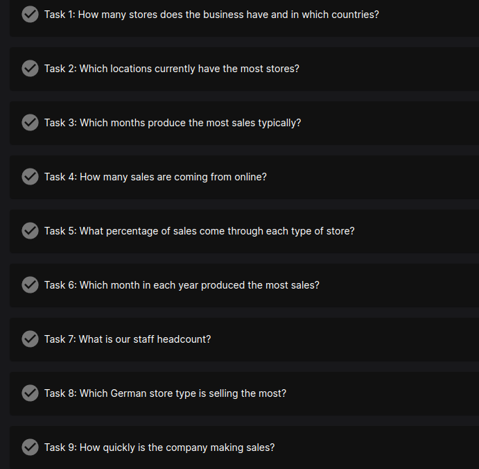

# Multinational Retail Data Centralisation Project

## Introduction

As I started this project I wanted to do everything in Docker as I have used this tool a lot recently and know it is used ubiquitously throughout industry. 
I started by finding the Docker images for postgres and pgadmin4 and seeing if I could do what I wanted. After finding the images and running a docker compose, I couldn't access the pgadmin container via localhost:5000 or any port I tried to set it to. In the end I managed to make it work by setting PGADMIN_LISTEN_ADDRESS=0.0.0.0 in the environment variables. I think the default was [::], which perhaps does not work on my OS, Ubuntu.
I created a .env file for all the details adding PGADMIN_LISTEN_PORT=5050 and PGADMIN_LISTEN_ADDRESS=0.0.0.0 to the environment variables. This changed the access address from the default [::]:80 to 0.0.0.0:5050. Once I was connected I managed to connect to the postgres container by simply accessing the name of the container I had selected, a useful feature of Docker. 

```
PGADMIN_DEFAULT_EMAIL=cjq234@gmail.com
PGADMIN_DEFAULT_PASSWORD=pgpassword
PGADMIN_LISTEN_PORT=5050
PGADMIN_LISTEN_ADDRESS=0.0.0.0
POSTGRES_USER=postgres
POSTGRES_PASSWORD=pgpassword
```

I proceeded to set up the Docker Compose file and Dockerfile to boot the containers as I wanted with volumes for each. Next I added a third container for my python script, I will need to add more details to it as I work out which ports I will need to use. 

---

### Setting up methods following object oriented programming

I created 3 python files for 3 classes of components of my pipeline. A data extractor, a data connector and a data cleaner. I started writing methods for each. I began by writing a method to load my database credentials from a yaml file. Then I created a method to instantiate my SQLAlchemy engine with the credentials from the previous method. 

*read_db_creds later renamed load_yaml as used for different tasks. Credentials added as an argument for init_db_engine allowing multiple engines from different credentials, for instance for taking data from source database and loading to another after cleaning.

```python
    def read_db_creds():
        with open("config/db_creds.yaml", "r") as outfile:
            # Load the contents of the file as a dictionary
            credentials = yaml.safe_load(outfile)
            return credentials

    def init_db_engine():
        credentials = DatabaseConnector.read_db_creds()
        sqlalchemy_url = sqlalchemy.engine.URL.create(
            "postgresql",
            username=credentials["RDS_USER"],
            password=credentials["RDS_PASSWORD"],
            host=credentials["RDS_HOST"],
            port=credentials["RDS_PORT"],
            database=credentials["RDS_DATABASE"],
        )
        engine = create_engine(sqlalchemy_url)
        return engine

```
For the data extractor module, I wrote a method which, with arguments of the table name and the sqlalchemy engine, runs a query to the database for the entire table provided (SELECT * FROM <table_name>)and converts it to a Pandas dataframe. This method is not available for SQLalchemy 2.0, so I removed argument future=true in the sqlalchemy create_engine method which I had taken from the documentation.

```python
def df_extract_rds_table(engine, table_name):
        df = pd.read_sql(f"SELECT * FROM {table_name}", engine)
        return df
```

Later I will be adding more methods to extract from multiple sources and multiple formats.

---

## Extraction and Data cleaning Summary

From an AWS RDS server, I used SQLAlchemy to connect and then used pd.read_sql to run an SQLQuery for the entire "legacy_users" table and load it into a dataframe.

From a S3 direct link, I used the tabula library to load a pdf file with a table of card details into a dataframe. 

Using an API, by using a loop to send get requests to an endpoint for each store url to retrieve a json file of the store details and append them into one dataframe.

Accessing an S3 bucket using the bucket key and pd.read_csv() to load the products table from an csv file into a dataframe.

For the sake of learning, I used a combination of different tools to explore, clean and format the tables. Sometimes I used pandas and sometimes I used pgadmin and SQL queries, sometimes both. What I did is not a recommendation for a pipeline, but merely to show my ability to use both. 

I had 6 datasets to explore, clean and reformat before uploading them to my postgres database for analysis: User info, credit card details, datetime events, product info, store details and finally the orders table which would be the centre table linking to the others in a star schema. 

---

### User details table

As the user details data was in an AWS RDS server, I could connect to it directly with pgadmin. This allowed me to use SQL queries to have a look at the legacy_users data and decide what cleaning steps are necessary. 


```sql
SELECT * FROM legacy_users
WHERE first_name = 'NULL' OR
last_name = 'NULL' OR
date_of_birth = 'NULL' OR
company = 'NULL' OR
email_address = 'NULL' OR
address = 'NULL' OR
country = 'NULL' OR
country_code = 'NULL' OR
phone_number = 'NULL' OR
join_date = 'NULL' OR
user_uuid = 'NULL';
```

The above SQL query showed that there are no rows with null in a single field, there are only entirely null rows. I can safely remove those rows. To isolate those rows, I can use a column with discrete values with low number of unique options:


```sql
SELECT * FROM legacy_users
WHERE country NOT IN ('Germany', 'United Kingdom', 'United States');
```

This query was interesting because it left only NULL and rubbish data. It also showed no entries where the country was NULL or rubbish and the other columns were fine. This indicates again that we are cleaning only complete rows of NULL or rubbish, not individual fields which would be more complicated. 

Further exploration will be done with Pandas by loading the database into a dataframe.

##### Phone numbers
The phone numbers had all sorts of non-integer characters in them which needed to be removed. By using regex I used re.sub and the inverse character \D to remove all non-integers from the number (D is integers in regex). I used a python library called phonenumbers to parse and format the phone numbers, using the country_code as an argument to format them based on their country code. 

##### Dates
How to format date columns is open to interpretation as it depends what sort of analytical queries we might want to run. Having them in datetime formats is useful for the calculation of timespan from those dates, say for promotional offers, however if human legibility is preferable, then a string of dd MMM yyyy, eg 29 Dec 2022 is the least ambiguous internationally. 

##### Data types and N/A of any invalid data 
Aside from dates, the only entries which should not be strings are the country and country_codes which should be category type. By using pd.astype() I changed these as required.

---

### Dim Card Details table

#### Pdf file

The card details came from a pdf file. To parse this information I used Tabula, a library for java which can read pdfs. To use it within python there is the tabula-py library. In order to use this I had to change my docker image for my app to one which has both java and python installed. I found this in Docker hub. 

#### Starting data

`df.head()` outputs:

|    |   0 | 1                | 2           | 3                           | 4                      |   5 |   6 |
|---:|----:|:-----------------|:------------|:----------------------------|:-----------------------|----:|----:|
|  0 | nan | nan              | nan         | nan                         | nan                    | nan | nan |
|  1 | nan | card_number      | expiry_date | card_provider               | date_payment_confirmed | nan | nan |
|  2 |   0 | 30060773296197   | 09/26       | Diners Club / Carte Blanche | 2015-11-25             | nan | nan |
|  3 |   1 | 349624180933183  | 10/23       | American Express            | 2001-06-18             | nan | nan |
|  4 |   2 | 3529023891650499 | 06/23       | JCB 16 digit                | 2000-12-26             | nan | nan |

As we can see, there are a few issues to fix. I started by using df.dropna() to drop any rows or columns which were completely null. 

This dropped row 6 but not row 5, indicating there might be some data in row 5. 

I initially used a technique to set the second row with the column headers as the column headers, however this caused the nan entries to be added to the index column, which seemed peculiar. Instead I manually entered the column headers with df.columns = [] and dropped the headers row. I named the assorted columns data_0 and data_5 just for ease of accessing whilst cleaning.

I wanted to inspect row 5, so I made a mask using df["data_5].notnull() which returns true for all rows which are not null. By then using df[mask] I can get all those rows. 

The only one was row 56:
```
# data_0                                 NaN
# card_number                           53.0
# expiry_date               4131871381315066
# card_provider                        03/27
# date_payment_confirmed       VISA 16 digit
# data_5                          2007-07-30
# Name: 56, dtype: object
```

The row has been shifted to the right. Rather than simply fix the row, I wrote a function which moves all the data to the right place, as in industry it might be required in the future for further batches of data. 

Next I checked for any remaining rows where 1 or more entries were null. Similar to previous technique, I used a mask of `df.null()`, `mask.any(axis=1)` and finally `df.loc[mask]` to view any rows containing 1 or more null values. 

This revealed a block of rows where the card information was not entered correctly. The card number was in the data_0 column, and the rest of the information was concatenated in the card_number column. I wrote a function to fix this, then used `.apply()` and `.update()` to correct the original dataframe.

Finally I used the discrete category of the card_provider to find all the unique card_provider entries with `df["card_provider"].unique()`. By manually creating from this list the legit card provider list, I used `df.loc[~df["card_provider].isin(legit_card_providers)]` to reveal a lot of bad rows with nonsense information. I could then drop these by:
```python
df = df.loc[df["card_provider"].isin(legit_card_providers)]
```

I then used the previously used date clean function to clean the date_payment_confirmed column to a legible format. 

Finally I used:

```python
df.drop(columns="data_0", inplace=True)
df.reset_index(drop=True, inplace=True)
```

to drop the data_0 column and reset the index given all our removed rows.

---

### Dim Store Details

`df2["lat"].unique()` output:
```
array(['N/A', None, '13KJZ890JH', '2XE1OWOC23', 'NULL', 'OXVE5QR07O',
       'VKA5I8H32X', 'LACCWDI0SB', 'A3O5CBWAMD', 'UXMWDMX1LC'],
      dtype=object)
```

Since it had no useful information, the column was dropped.


`df2["country_code"].unique()` output: 
```
array([None, 'GB', 'DE', 'US', 'YELVM536YT', 'FP8DLXQVGH', 'NULL',
       'HMHIFNLOBN', 'F3AO8V2LHU', 'OH20I92LX3', 'OYVW925ZL8',
       'B3EH2ZGQAV'], dtype=object) 
```

I used the same method I have before: Cut the 'all' null rows, fix the 'any' null rows then use the discrete category column (GB/DE/US) to cut any unwanted bad data rows.

After dropping the 'all' null rows, I moved to the 'any' null rows that might need fixing, the sequence:
```python
mask = df2.isnull()
mask = mask.any(axis=1)
any_null_rows = df2.loc[mask]
```
...revealed that the only row which has some null entries was store 0, the webstore. We want to keep this so we do not need any further action for 'any' null rows.

Proceeding to the final step, I found the unique continent values, `df2["continent"].unique()` output:

```
array([None, 'Europe', 'America', 'eeEurope', 'eeAmerica'], dtype=object)
```
so I used:
```python
df.loc[df["continent"] == "eeEurope", "continent"] = "Europe"
df.loc[df["continent"] == "eeAmerica", "continent"] = "America"
```
to change those.

`df2["store_type"].unique()` output:
```
array(['Web Portal', 'Local', 'Super Store', 'Mall Kiosk', 'Outlet'],
      dtype=object)
```

looks fine, so no action taken.

The staff numbers column had some non-integers so was purified using the regex method previously used.

It makes more sense to have longitude and latitude next to each other, although they also seem like useless information but we will see what is required from the data.
```python
# moving the latitude column next to the longitude
latitude = df.pop("latitude")
df.insert(3, "latitude", latitude)

# moving the store_code column to far left
col_move = df.pop("store_code")
df.insert(0, "store_code", col_move)
```

 
The store code was moved to the first column. 

The index column has no rogue data in it, so can be dropped.

The first row for the webstore can have pd.NA for all the N/A values for consistency. 

---

### Products

By using boto3 I imported a csv in an s3 bucket into a pandas dataframe. First by creating the boto3 client and then by using s3.get_object to create a response from the server. Then using pd.read_csv on the body of the response. 

I used the same method as before, this time using the "category" column 

`df["category"].unique()` outputs:
```
array(['toys-and-games', 'sports-and-leisure', nan, 'pets', 'homeware',
       'S1YB74MLMJ', 'C3NCA2CL35', 'WVPMHZP59U', 'health-and-beauty',
       'food-and-drink', 'diy'], dtype=object)
```
```python
# cut out any bad categories
legit_category = ['toys-and-games', 'sports-and-leisure', 'pets', 'homeware','health-and-beauty',
       'food-and-drink', 'diy']

# create a mask
mask = df["category"].isin(legit_category)

# checking this first to see bad rows (~ inverse mask)
df[~mask]

# making df equal to df without those rows
df = df[mask]
```

All the values in the "product_weight" category needed normalising. I wrote a function called product_weight_clean() which does this. In short it uses strip and split and replace and float to adjust to create 3 new columns: units_in_product, unit_weight and product_weight. I used reindex to move columns to a more logical order.


---
### Uploading it all to my Database

Using my dataconnector class I created a second SQLAlchemy engine for my own postgreSQL database: "sales_engine".

I then used `df.to_sql("table_name", engine"` to send each table to my new database.

---

## SQL queries 

After uploading all my tables to my postgresql database, I need to adjust datatypes and reformat the table for analytical use.

Below is an example of one of the formatting SQL queries I wrote for the products table. 

```SQL
ALTER TABLE dim_products_table
    DROP COLUMN index,
    ADD COLUMN weight_class VARCHAR(255);

UPDATE dim_products_table
SET weight_class =
    CASE
        WHEN product_weight BETWEEN 0 AND 3 THEN 'Light'
        WHEN product_weight BETWEEN 3 AND 41 THEN 'Mid_Sized'
        WHEN product_weight BETWEEN 41 AND 141 THEN 'Heavy'
        WHEN product_weight BETWEEN 141 AND 200 THEN 'Truck_Required'
        ELSE 'Other'
    END;

ALTER TABLE dim_products_table
    RENAME COLUMN removed TO still_available;

ALTER TABLE dim_products_table
	ALTER COLUMN product_price TYPE FLOAT,
	ALTER COLUMN "EAN" TYPE VARCHAR(18),
	ALTER COLUMN product_code TYPE VARCHAR(12),
	ALTER COLUMN date_added TYPE DATE USING date_added::date,
	ALTER COLUMN uuid TYPE UUID USING uuid::uuid,
	ALTER COLUMN weight_class TYPE VARCHAR(15),
    ALTER COLUMN unit_weight TYPE SMALLINT,
    ALTER COLUMN units_in_product TYPE SMALLINT;

UPDATE dim_products_table
SET still_available =
    CASE still_available
        WHEN 'Available' THEN TRUE
        WHEN 'Removed' THEN FALSE
        ELSE NULL
    END;

ALTER TABLE dim_products_table
    ALTER COLUMN still_available TYPE bool
	USING still_available::boolean;

```

I start by dropping the index column which was carried over by the Pandas dataframe. 

My task was to create an additional column for the weight which was more human friendly so that a hypothetical warehouse team could know how to pack and ship the product. For this I used a CASE statement to perform conditional logic on the product_weight column. Depending on the size of the number(the weight of the product), a category for that row was added: Light, Mid_Sized, Heavy, Truck_Required. 

There is a column for whether the product is still available or not, this is better as a boolean instead of a string. I renamed the column to still_available and used a CASE statement again to change 'Available' to TRUE and 'Removed' to FALSE. 

I alter the data type for every column to something more suitable including limiting the number of characters for each string: VARCHAR(n). This is done to conserve storage space and improve query performance.

```sql
ALTER TABLE dim_users
ADD PRIMARY KEY (user_uuid);

ALTER TABLE dim_store_details
ADD PRIMARY KEY (store_code);

ALTER TABLE dim_products_table
ADD PRIMARY KEY (product_code);

ALTER TABLE dim_date_times
ADD PRIMARY KEY (date_uuid);

ALTER TABLE dim_card_details
ADD PRIMARY KEY (card_number);
```
I set the primary key for each table.

```sql
ALTER TABLE orders_table
    ADD FOREIGN KEY (user_uuid) REFERENCES dim_users (user_uuid),
    ADD FOREIGN KEY (store_code) REFERENCES dim_store_details (store_code),
    ADD FOREIGN KEY (product_code) REFERENCES dim_products_table (product_code),
    ADD FOREIGN KEY (date_uuid) REFERENCES dim_date_times (date_uuid),
    ADD FOREIGN KEY (card_number) REFERENCES dim_card_details (card_number);
```
I added foreign key contraints to each column to enforce reference between the columns. In other words, prevent any insertion or update in the table that does not match the values in the referenced column and table. 

## Analysis

AICore gave the following set of questions for the SQL analysis:



My answers to these can be found in the analysis folder. I used Joins, Aggregations, Group By and Order by clauses, Sums and Case and Nested queries. 